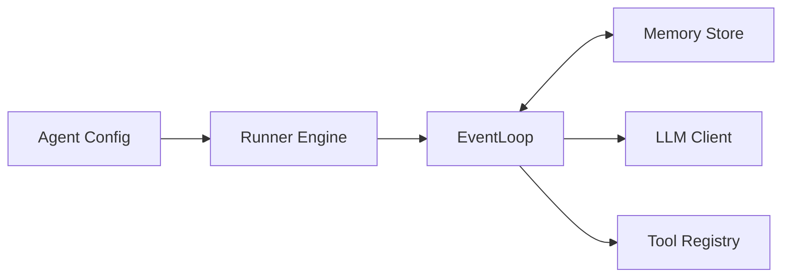

# Agent Forge Kit (AFK) Python SDK (v1.0.0)

**A production-grade framework for building robust, deterministic agent systems.**

**Documentation:** [afk.arpan.sh](https://afk.arpan.sh)

AFK is built for engineers who need more than just a "chat loop." It provides a typed, observable, and fail-safe runtime for orchestrating complex agent behaviors, managing long-running threads, and integrating with your existing infrastructure.

## Architecture

The framework is built on three core pillars:

1.  **Agent**: Stateless definition of identity, instructions, and tools.
2.  **Runner**: Stateful execution engine managing the event loop and memory.
3.  **Runtime**: Underlying capabilities (LLM I/O, Tool Registry).



## Key Capabilities

- **Deterministic Orchestration**: Type-safe event loop with guaranteed lifecycle events.
- **Fail-Safe Runtime**: Configurable circuit breakers, cost limits, and retry policies.
- **Observability First**: Built-in OpenTelemetry tracing and structured metrics.
- **Deep Tooling**: Secure tool execution with policy hooks and sandbox profiles.
- **Scalable Memory**: Pluggable backends (SQLite, Redis, Postgres) with auto-compaction.

## Why AFK

AFK is for teams moving from demos to production agents.

- Use AFK when you need **predictable runs**, **typed tool contracts**, and **policy-gated actions**.
- Use AFK when reliability matters: retries, limits, circuit breakers, observability, and evals are built in.
- Use AFK when you want provider flexibility without rewriting agent logic for each model vendor.

Choose AFK over raw SDK calls when your workflow includes tools, multi-step execution, approvals, or release gating.
Choose a raw SDK when you only need simple chat/completions and minimal runtime behavior.

## Installation

```bash
pip install the-afk==1.0.0
```

## Quick Start

The `Runner` supports both synchronous (script) and asynchronous (server) execution modes.

```python
import asyncio
from afk.agents import Agent
from afk.core import Runner

# 1. Define your agent (stateless)
agent = Agent(
    name="ops-bot",
    model="gpt-4.1-mini",
    instructions="You are a helpful SRE assistant.",
)

# 2. Run it (stateful)
async def main():
    runner = Runner()
    result = await runner.run(agent, user_message="Check system health")

    print(f"Status: {result.state}")
    print(f"Output: {result.final_text}")

if __name__ == "__main__":
    asyncio.run(main())
```

> **Note**: For scripts and CLI tools, you can use `runner.run_sync(...)`.

## Power User Features

AFK is designed for complexity. Here are some of the advanced features available out of the box:

### Fail-Safe Controls

Prevent runaway costs and infinite loops with `FailSafeConfig`.

```python
from afk.agents import FailSafeConfig

agent = Agent(
    ...,
    fail_safe=FailSafeConfig(
        max_steps=20,
        max_total_cost_usd=1.00,  # Hard stop at $1
        subagent_failure_policy="continue_with_error",
    )
)
```

[Read the Configuration Reference →](https://afk.arpan.sh/library/configuration-reference)

### Streaming

Build real-time UIs with the event stream API.

```python
handle = await runner.run_stream(agent, user_message="...")
async for event in handle:
    if event.type == "text_delta":
        print(event.text_delta, end="")
```

[Read the Streaming Guide →](https://afk.arpan.sh/library/streaming)

### Evals

Test your agents with the built-in eval suite.

```python
from afk.evals import run_suite, EvalCase

await run_suite(
    cases=[
        EvalCase(input="Hello", assertions=[...])
    ]
)
```

[Read the Evals Guide →](https://afk.arpan.sh/library/evals)

## Documentation

- **[Configuration Reference](https://afk.arpan.sh/library/configuration-reference)**: Full list of options.
- **[API Reference](https://afk.arpan.sh/library/api-reference)**: Classes and methods.
- **[Architecture & Modules](https://afk.arpan.sh/library/full-module-reference)**: Inner workings.

## License

MIT. See `LICENSE`.
