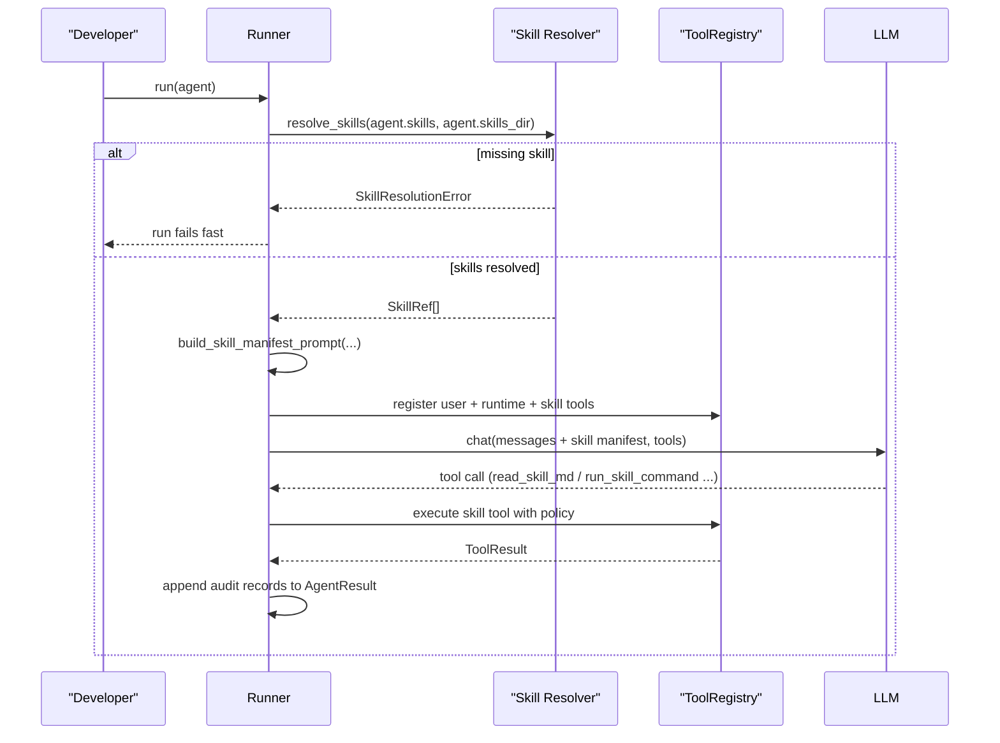

This page explains how AFK skills work in production: resolution, prompt injection, skill tools, security controls, and audit records.

Primary code paths:

- [afk/agents/base.py](https://github.com/socioy/afk/blob/main/src/afk/agents/base.py)
- [afk/agents/runtime.py](https://github.com/socioy/afk/blob/main/src/afk/agents/runtime.py)
- [afk/tools/prebuilts/skills.py](https://github.com/socioy/afk/blob/main/src/afk/tools/prebuilts/skills.py)
- [afk/core/runner_execution.py](https://github.com/socioy/afk/blob/main/src/afk/core/runner_execution.py)
- [afk/agents/types.py](https://github.com/socioy/afk/blob/main/src/afk/agents/types.py)
- [afk/agents/errors.py](https://github.com/socioy/afk/blob/main/src/afk/agents/errors.py)

## TL;DR

- Skills are declared on `Agent(skills=[...], skills_dir=...)`.
- Each skill must exist at `<skills_dir>/<skill_name>/SKILL.md`.
- When skills resolve, AFK injects a skill manifest into system instructions.
- AFK can auto-register skill tools (`list_skills`, `read_skill_md`, `read_skill_file`, `run_skill_command`).
- Skill reads and command runs are recorded in `AgentResult` for auditability.

## Skill Directory Contract

Expected layout:

```text
.agents/skills/
  security-review/
    SKILL.md
    references/checklist.md
  sql-debugger/
    SKILL.md
    scripts/explain_plan.sh
```

Rules:

- `skills` values are folder names under `skills_dir`.
- Each skill folder must contain `SKILL.md`.
- Missing skills fail run startup with `SkillResolutionError`.

## Configure Skills on an Agent

```python
from afk.agents import Agent, SkillToolPolicy
from afk.core import Runner, RunnerConfig

agent = Agent(
    name="OpsAssistant",
    model="gpt-4.1-mini",
    instructions="Use enabled skills before taking operational actions.",
    skills=["security-review", "sql-debugger"],
    skills_dir=".agents/skills",
    enable_skill_tools=True,
    skill_tool_policy=SkillToolPolicy(
        command_allowlist=["python", "uv", "pytest", "bash"],
        deny_shell_operators=True,
        command_timeout_s=20.0,
        max_stdout_chars=8000,
        max_stderr_chars=8000,
    ),
)

runner = Runner(
    config=RunnerConfig(
        # Used only when skill_tool_policy.command_allowlist is empty.
        default_allowlisted_commands=("ls", "cat", "head", "tail", "rg", "find", "pwd", "echo"),
    )
)
```

## Runtime Flow



## Built-In Skill Tools

- `list_skills`: returns resolved skills with `name`, `skill_md_path`, `checksum`.
- `read_skill_md`: reads `<skill>/SKILL.md` for one skill.
- `read_skill_file`: reads an additional file under the selected skill root.
- `run_skill_command`: runs allowlisted command with timeout and output caps.

## Security and Edge Cases

- Missing skill name in `skills`: `SkillResolutionError` before step loop starts.
- Unknown skill in tool args: `SkillAccessError`.
- Path escape attempt in `read_skill_file`: `SkillAccessError`.
- Command not allowlisted: `SkillCommandDeniedError`.
- Denied shell operators (when enabled): `SkillCommandDeniedError`.
- `cwd` outside skill roots: `SkillAccessError`.
- Command timeout: `SkillCommandDeniedError`.
- `stdout`/`stderr` are truncated by `SkillToolPolicy` limits.

## What You Can Audit

`AgentResult` exposes skill activity directly:

- `skills_used`
- `skill_reads`
- `skill_command_executions`

```python
result = await runner.run(agent, user_message="Review migration plan")

print(result.skills_used)
print(result.skill_reads)
print(result.skill_command_executions)
```

## Recommended Production Defaults

1. Keep `skills` list explicit and minimal per agent.
2. Use strict `command_allowlist`; avoid broad executors unless required.
3. Keep `deny_shell_operators=True`.
4. Cap `command_timeout_s`, `max_stdout_chars`, and `max_stderr_chars`.
5. Monitor `skill_command_executions` for denied/failed command patterns.

## Related Docs

- [Tools Walkthrough](/library/tools-system-walkthrough)
- [Tool Call Lifecycle](/library/tool-call-lifecycle)
- [Security Model](/library/security-model)
- [API Reference](/library/api-reference)
