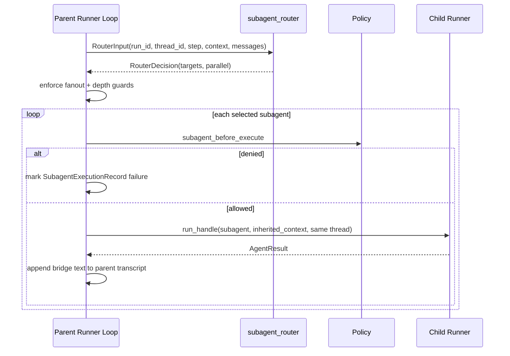

# Agentic Behavior and Orchestration

This document focuses on multi-step reasoning behavior: subagents, routing, context inheritance, and control guards.

## TL;DR

- Parent agents can route work to named subagents per step.
- Context inheritance is explicit (`inherit_context_keys`) not automatic.
- Fanout, depth, and cycle guards protect runtime stability.
- Subagent failures map through the configured failure policy.

## When To Read This

- You are moving from single-agent to multi-agent orchestration.
- You need deterministic routing behavior.
- You need safe boundaries between parent/child contexts.

Primary code paths:

- [afk/agents/base.py](../../src/afk/agents/base.py)
- [afk/core/runner_execution.py](../../src/afk/core/runner_execution.py)
- [afk/core/runner_interaction.py](../../src/afk/core/runner_interaction.py)
- [afk/core/runner_internals.py](../../src/afk/core/runner_internals.py)

## Orchestration Model

A run loop step can include all of the following:

1. Optional subagent routing/execution
2. Main-agent LLM call
3. Optional tool execution batch
4. Loop continuation until terminal completion/failure/cancel/degrade

## Subagent Routing Lifecycle

## Context Inheritance Rules

- Parent context is not copied wholesale.
- Child receives only keys listed in child `inherit_context_keys`.
- This enforces explicit context boundaries between agents.

## Parallelism Behavior

Effective subagent parallel mode:

- `single`: always serial, first selected subagent only
- `parallel`: always parallel
- `configurable`: follows router `parallel` flag

## Safety Guards

Guards enforced before/during subagent execution:

- max recursion depth (`max_subagent_depth`)
- cycle detection via lineage tracking
- per-step fanout limit (`max_subagent_fanout_per_step`)
- per-subagent policy gate

Violation outcomes:

- routing violations raise `SubagentRoutingError`
- execution failures become `SubagentExecutionRecord(success=False)` and then map through subagent failure policy

## Failure Policy Outcome for Subagents

Subagent failures are normalized through `subagent_failure_policy`:

- `fail`: run fails
- `degrade`: run enters degraded terminal path
- `continue`: run continues with bridge text indicating failure

## Agent State and Agentic Steps

Agentic behavior still uses the same global run state machine:

- starts at `pending`
- transitions to `running`
- can pause/resume on HITL gates
- can finish in `completed`, `failed`, `cancelled`, or `degraded`

## Practical Design Guidance

When to use subagents:

- distinct concerns requiring separate prompts/guardrails
- reusable specialist roles (writer/reviewer/researcher)
- explicit context boundary needs

When not to use subagents:

- simple single-pass tasks
- tasks where shared global transcript is sufficient
- workflows that can be solved by tool orchestration only

## Implementation Checklist

1. Start with one parent and one child agent before adding fanout.
2. Keep `inherit_context_keys` narrow to reduce accidental coupling.
3. Make router logic deterministic for similar inputs.
4. Configure `max_subagent_depth` and fanout limits conservatively.
5. Decide failure behavior early (`fail`, `degrade`, or `continue`).

## Related Example

- [examples/03_subagents_with_router.py](./examples/03_subagents_with_router.py)
