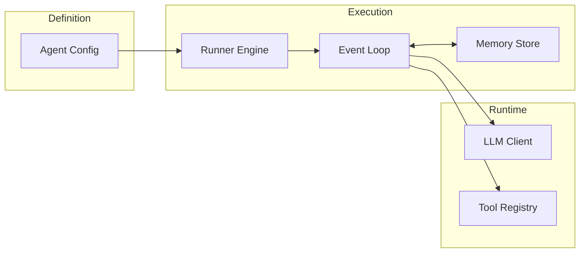

This page provides a quick reference for commonly used AFK imports and constructor signatures. For the full field-by-field reference, see the [Configuration Reference](/library/configuration-reference). For module-level documentation, see the [Module Reference](/library/full-module-reference).

## Quick import map

| Task                    | Import                                                | From               |
| ----------------------- | ----------------------------------------------------- | ------------------ |
| Define an agent         | `from afk.agents import Agent`                        | `afk.agents`       |
| Configure safety limits | `from afk.agents import FailSafeConfig`               | `afk.agents`       |
| Set up policy engine    | `from afk.agents import PolicyEngine, PolicyRule`     | `afk.agents`       |
| Run an agent            | `from afk.core import Runner`                         | `afk.core`         |
| Configure the runner    | `from afk.core import RunnerConfig`                   | `afk.core`         |
| Debug a run             | `from afk.debugger import Debugger, DebuggerConfig`   | `afk.debugger`     |
| Define a tool           | `from afk.tools import tool`                          | `afk.tools`        |
| Tool context access     | `from afk.tools import ToolContext`                   | `afk.tools`        |
| Tool hooks              | `from afk.tools import prehook, posthook, middleware` | `afk.tools`        |
| Build an LLM client     | `from afk.llms import LLMBuilder`                     | `afk.llms`         |
| Run evals               | `from afk.evals import run_suite`                     | `afk.evals`        |
| Define eval cases       | `from afk.evals.models import EvalCase, EvalBudget`   | `afk.evals.models` |
| A2A client              | `from afk.a2a import A2AClient`                       | `afk.a2a`          |
| MCP server              | `from afk.mcp import MCPServer`                       | `afk.mcp`          |
| Task queue              | `from afk.queues import TaskQueue, TaskItem`          | `afk.queues`       |

## Architecture overview

The framework is built on three core pillars that interact at runtime:

1.  **Agent** (`afk.agents.Agent`) — The **definition**.
    It holds the static configuration: "Who am I?" (instructions, name), "What can I do?" (tools, subagents), and "How safe am I?" (fail-safe limits). Agents are stateless definitions that can be reused across many runs.

2.  **Runner** (`afk.core.Runner`) — The **engine**.
    It orchestrates the dynamic execution: managing the event loop, maintaining conversation state in memory, executing tools, handling failures, and dispatching events to telemetry. Runners are stateful (holding connections to memory/telemetry) but re-entrant.

3.  **Runtime** (`afk.llms`, `afk.tools`) — The **capabilities**.
    The underlying machinery that powers the agent: LLM clients handling provider I/O, and the tool registry managing safe execution of Python functions.



## Execution model

The `Runner` supports three execution modes for different use cases. All modes use the same underlying event loop and guarantee the same consistency models.

### 1. Synchronous (`run_sync`)

Blocks the calling thread until the run is complete. Best for scripts, cron jobs, and simple CLI tools.

- **Concurrency**: Internal tasks (like tool execution) still run on the asyncio event loop, but the entry point is blocking.
- **Return**: Returns the final `AgentResult` only after the run reaches a terminal state (`completed`, `failed`).

### 2. Asynchronous (`await run`)

Returns an awaitable coroutine. Best for backend API handlers (FastAPI, Django Async) and high-concurrency workloads.

- **Concurrency**: Non-blocking. Allows thousands of concurrent agent runs in a single process.
- **Return**: Returns `AgentResult` upon completion.

### 3. Streaming (`await run_stream`)

Returns an async iterator of `AgentStreamEvent`s. Best for real-time UIs (chatbots, IDE integrations).

- **Feedback**: Emits events _immediately_ as they happen (token delta, tool start, tool end).
- **Control**: Allows the consumer to abort the run by cancelling the stream consumption.

---

## Most common pattern

```python
from afk.agents import Agent, FailSafeConfig
from afk.tools import tool
from afk.core import Runner, RunnerConfig
from pydantic import BaseModel
```

---

## Constructor signatures

### Agent

```python
from afk.agents import Agent

agent = Agent(
    *,
    model: str | LLM,                                    # Required — model name or client
    name: str | None = None,                             # Agent identity
    instructions: str | callable | None = None,          # System prompt
    instruction_file: str | Path | None = None,          # Prompt file path
    tools: list | None = None,                           # Tool list
    subagents: list[Agent] | None = None,                # Specialist subagents
    context_defaults: dict | None = None,                # Default run context
    fail_safe: FailSafeConfig | None = None,             # Limits and failure policies
    max_steps: int = 20,                                 # Max loop iterations
    policy_engine: PolicyEngine | None = None,           # Deterministic policy rules
    model_resolver: callable | None = None,              # Custom model resolver
    skills: list[str] | None = None,                     # Skill names to load
    mcp_servers: list | None = None,                     # External MCP server refs
)
```

<Tip>
  Only `model` is required. See the [Configuration
  Reference](/library/configuration-reference#agent) for the full list of 25+
  fields with defaults.
</Tip>

### Runner

```python
from afk.core import Runner

runner = Runner(
    *,
    memory_store: MemoryStore | None = None,             # Memory backend
    interaction_provider: InteractionProvider | None = None,  # HITL provider
    policy_engine: PolicyEngine | None = None,           # Shared policy engine
    telemetry: str | TelemetrySink | None = None,        # "console" | "otel" | "json"
    telemetry_config: dict | None = None,                # Backend config
    config: RunnerConfig | None = None,                  # Runner configuration
)
```

#### Key Runner methods

- **`run_sync(agent, ...)`** -> `AgentResult`
  Blocking execution. In memory-backend modes, this persists state to the DB at every step. In-memory mode is transient.
  _Use for:_ Scripts, CLI tools, tests.

- **`await run(agent, ...)`** -> `AgentResult`
  Async execution. This is the standard entry point for scalable applications. It handles the full agent loop: LLM calls -> Tool execution -> Policy checks -> Recursion.
  _Use for:_ Web servers, queue workers, scalable backend services.

- **`await run_stream(agent, ...)`** -> `AgentStreamHandle`
  Returns a handle exposing an `async iterator` of events. The stream yields events as they happen. You MUST consume the stream to drive execution forward.
  _Use for:_ Chat interfaces, real-time feedback.

- **`await resume(agent, *, run_id, thread_id)`** -> `AgentResult`
  Re-hydrates a run from the database. It loads the full execution snapshot (messages, unexecuted tool calls) and continues exactly where it left off.
  _Use for:_ Human-in-the-loop workflows (resume after approval), recovering from process crashes.

- **`await compact_thread(*, thread_id)`** -> `None`
  Triggers memory compaction for a specific thread. This applies the configured `RetentionPolicy` to reduce token usage by summarizing history or discarding old messages.
  _Use for:_ Long-running conversations where context window limits are a concern.

### RunnerConfig

```python
from afk.core import RunnerConfig

config = RunnerConfig(
    interaction_mode: str = "headless",                  # "headless" | "interactive" | "external"
    sanitize_tool_output: bool = True,                   # Strip injection vectors
    tool_output_max_chars: int = 12_000,                 # Output truncation limit
    approval_timeout_s: float = 300.0,                   # Approval timeout
    approval_fallback: str = "deny",                     # "allow" | "deny" | "defer"
)
```

### FailSafeConfig

```python
from afk.agents import FailSafeConfig

fail_safe = FailSafeConfig(
    max_steps: int = 20,                                 # Max run loop iterations
    max_llm_calls: int = 50,                             # Max LLM invocations
    max_tool_calls: int = 200,                           # Max tool invocations
    max_wall_time_s: float = 300.0,                      # Wall-clock timeout
    max_total_cost_usd: float | None = None,             # Cost ceiling
    llm_failure_policy: str = "retry_then_fail",         # LLM error strategy
    tool_failure_policy: str = "continue_with_error",    # Tool error strategy
    subagent_failure_policy: str = "continue",           # Subagent error strategy
    fallback_model_chain: list[str] = [],                # Fallback models
)
```

<Warning>
  **Always set `max_total_cost_usd`** in production. Without it, a runaway agent
  loop can spend significant API credits in minutes.
</Warning>

### @tool decorator

```python
from afk.tools import tool

@tool(
    *,
    args_model: Type[BaseModel],                         # Required — Pydantic args model
    name: str | None = None,                             # Tool name (default: function name)
    description: str | None = None,                      # LLM-visible description
    timeout: float | None = None,                        # Execution timeout in seconds
    prehooks: list[PreHook] | None = None,               # Argument transform hooks
    posthooks: list[PostHook] | None = None,             # Output transform hooks
    middlewares: list[Middleware] | None = None,          # Execution wrappers
    raise_on_error: bool = False,                        # Raise vs return ToolResult
)
```

---

## Core types

### AgentResult

| Field                 | Type                            | Description                                                                   |
| --------------------- | ------------------------------- | ----------------------------------------------------------------------------- |
| `final_text`          | `str`                           | The agent's final response                                                    |
| `state`               | `str`                           | Terminal state: `completed`, `failed`, `degraded`, `cancelled`, `interrupted` |
| `run_id`              | `str`                           | Unique run identifier                                                         |
| `thread_id`           | `str`                           | Thread identifier for memory continuity                                       |
| `tool_executions`     | `list[ToolExecutionRecord]`     | All tool calls with name, success, output, latency, and agent provenance       |
| `subagent_executions` | `list[SubagentExecutionRecord]` | All subagent invocations                                                      |
| `usage_aggregate`     | `UsageAggregate`                | Token counts and cost estimates                                               |
| `state_snapshot`      | `dict[str, JSONValue]`          | Final runtime counters/snapshot metadata                                       |

### AgentStreamEvent

| Field          | Type           | Description                                                          |
| -------------- | -------------- | -------------------------------------------------------------------- |
| `type`         | `str`          | Event category (see [Streaming](/library/streaming#event-reference)) |
| `text_delta`   | `str \| None`  | Incremental text chunk                                               |
| `tool_name`    | `str \| None`  | Tool name for tool events                                            |
| `tool_call_id` | `str \| None`  | Tool call identifier                                                 |
| `tool_success` | `bool \| None` | Whether tool succeeded                                               |
| `tool_output`  | `JSONValue \| None` | Tool output payload                                             |
| `tool_error`   | `str \| None`  | Tool error message                                                   |
| `step`         | `int \| None`  | Current step index                                                   |
| `state`        | `str \| None`  | Current agent state                                                  |
| `result`       | `AgentResult`  | Terminal result (for `completed` events)                             |
| `error`        | `str \| None`  | Error message (for `error` events)                                   |

---

## Agents module

<CardGroup cols={2}>
  <Card title="Agent" href="/library/agents">
    Core agent configuration — model, instructions, tools, subagents.
  </Card>
  <Card title="FailSafeConfig" href="/library/agents#adding-safety-limits">
    Step limits, cost budgets, timeout, failure policies.
  </Card>
  <Card title="PolicyEngine" href="/library/security-model">
    Policy rules for gating tool calls and actions.
  </Card>
  <Card
    title="PolicyRule"
    href="/library/security-model#boundary-1-policy-engine"
  >
    Individual policy rule definition.
  </Card>
</CardGroup>

## Core module

<CardGroup cols={2}>
  <Card title="Runner" href="/library/core-runner">
    Agent execution engine — sync, async, stream.
  </Card>
  <Card title="RunnerConfig" href="/library/core-runner#runner-configuration">
    Safety defaults, sanitization, interaction mode.
  </Card>
  <Card title="AgentResult" href="/library/core-runner#agentresult-reference">
    Run output — final_text, state, tool/subagent executions, usage.
  </Card>
</CardGroup>

## Tools module

<CardGroup cols={2}>
  <Card title="@tool decorator" href="/library/tools">
    Define typed tool functions with Pydantic models.
  </Card>
  <Card title="Hooks" href="/library/tools#hooks-and-middleware">
    Pre/post hooks and middleware for tool execution.
  </Card>
</CardGroup>

## LLM module

<CardGroup cols={2}>
  <Card title="LLMBuilder" href="/llms/index">
    Builder pattern for LLM client configuration.
  </Card>
  <Card title="LLMRequest / LLMResponse" href="/llms/contracts">
    Normalized contracts for LLM interaction.
  </Card>
</CardGroup>

## API stability

AFK follows semantic versioning. Public exports from `afk.agents`, `afk.core`, `afk.tools`, `afk.llms`, and `afk.evals` are considered stable and will not change without a major version bump.

Internal modules (prefixed with `_` or under `afk.core.runner._internal`) are not part of the public API and may change at any time.
