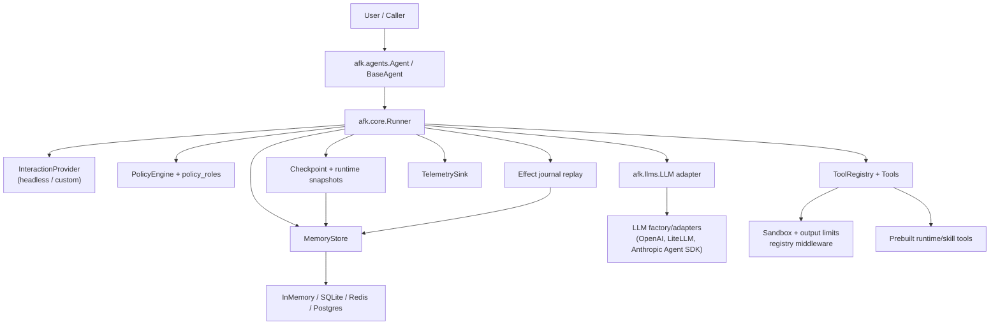
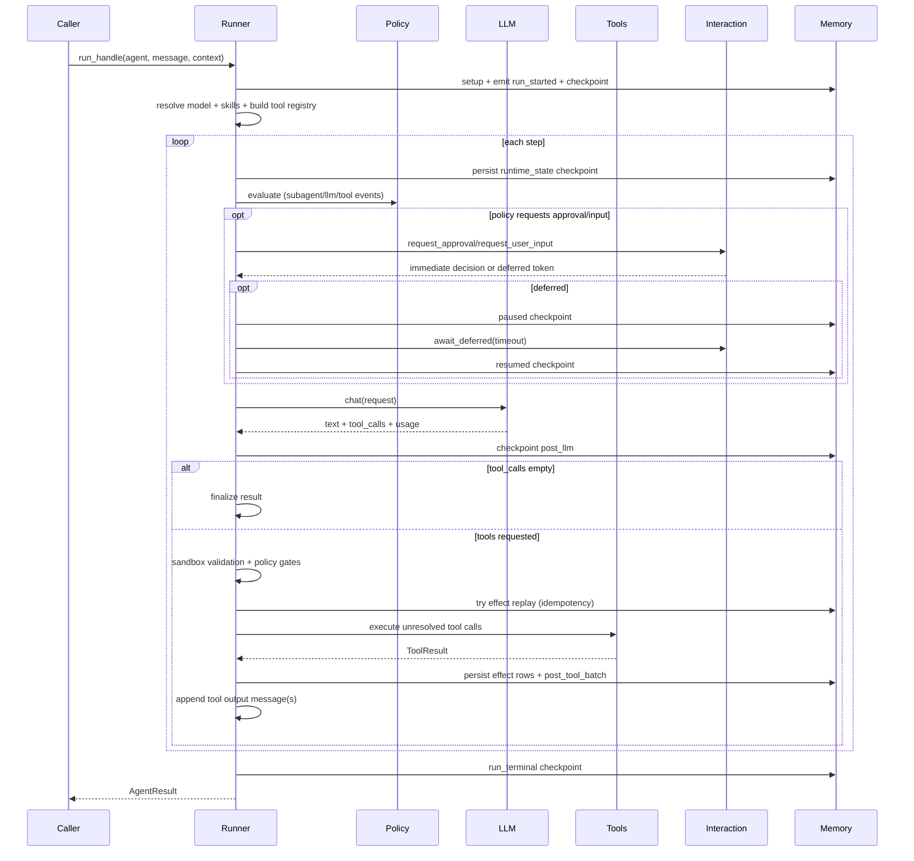
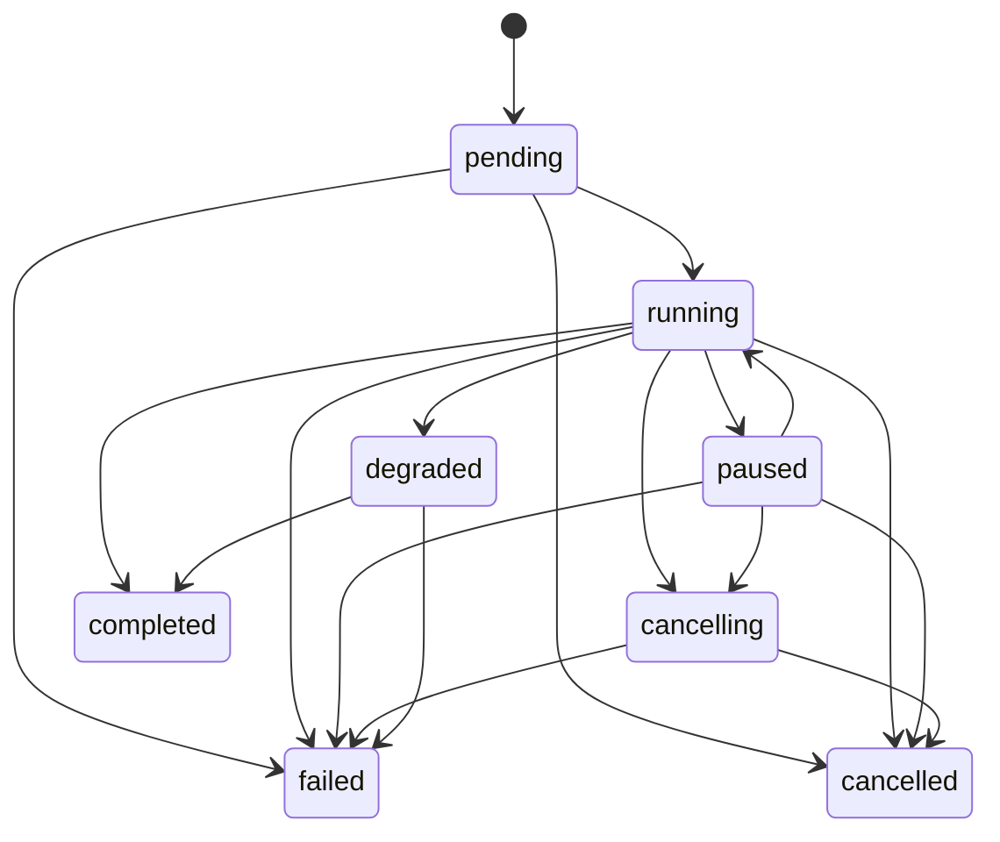

This page describes how the runtime is assembled from `afk` modules and how execution flows through policy, LLM, tools, memory, and telemetry.

## TL;DR

- `Agent` is configuration; `Runner` is execution.
- Each step: policy -> LLM -> optional tools -> checkpoint.
- Memory stores checkpoints and replayable tool effects.
- Security is enforced at tool boundaries (sandbox + sanitization).

## When To Read This

- You are integrating AFK into a backend and need a reliable mental model.
- You need to debug why a run paused, degraded, or failed.
- You are extending runtime behavior (policy, interaction, telemetry, memory).

Related deep dives:

- [Developer Guide](/library/developer-guide)
- [Tool Call Lifecycle](/library/tool-call-lifecycle)
- [Agent Skills](/library/agent-skills)
- [LLM Flow](/library/llm-interaction)
- [Agentic Orchestration](/library/agentic-behavior)
- [Checkpoint & Resume](/library/checkpoint-schema)
- [Run Event Contract](/library/run-event-contract)
- [Failure Policies](/library/failure-policy-matrix)
- [Security Model](/library/security-model)

## Component Diagram

## Run Sequence

## Agent State Model

State transitions are enforced by `validate_state_transition(...)` in `afk/agents/runtime.py`.

## Persistence Model

Runner stores checkpoints/state in memory backends with these key families:

- `checkpoint:{run_id}:{step}:{phase}`
- `checkpoint:{run_id}:latest`
- `effect:{run_id}:{step}:{tool_call_id}`

What is persisted:

- Lifecycle checkpoints (`run_started`, `pre_llm`, `post_llm`, `pre_tool_batch`, `post_tool_batch`, `run_terminal`, etc.)
- Runtime snapshots (`phase="runtime_state"`) with transcript/context/usage/counters
- Effect journal rows for idempotent replay of successful tool calls

Resume behavior:

- `Runner.resume_handle(...)` checks latest checkpoint.
- If latest checkpoint is already terminal and includes serialized terminal result, it returns immediately.
- Otherwise it loads latest `runtime_state` snapshot and continues from there.

## Security Model

Tool outputs are treated as untrusted by default:

- Untrusted preamble is injected into system context.
- Tool outputs can be sanitized/redacted/truncated before returning to LLM context.
- Optional sandbox profile can block:
  - network URLs
  - command execution
  - shell operators
  - out-of-bound filesystem paths

Main enforcement points:

- `validate_tool_args_against_sandbox(...)`
- `apply_tool_output_limits(...)`
- `RunnerConfig.sanitize_tool_output`

## Failure Policy Routing

`FailSafeConfig` policies are normalized into runtime actions:

- LLM failure policy => `fail` or `degrade`
- Tool/subagent/approval policies => `fail`, `degrade`, or `continue`

This mapping is centralized in `afk/core/runner_internals.py`.

## Telemetry Path

Runner emits telemetry for:

- run duration and terminal status
- per-event counters
- llm/tool/subagent latency histograms
- interaction wait latency
- span lifecycle with optional OpenTelemetry integration

Sinks:

- `NullTelemetrySink` (default no-op)
- `InMemoryTelemetrySink` (tests/debug)
- `OpenTelemetrySink` (if OTel packages are installed)

## Implementation Checklist

1. Choose model and adapter strategy (`model` prefix or resolver).
2. Set fail-safe limits (`max_steps`, budgets, failure policies).
3. Add policy gates for tool and LLM decisions.
4. Configure sandbox and sanitization for tool output.
5. Enable persistent memory backend before production rollout.
6. Monitor run events and telemetry to detect degraded paths early.

## Related Examples

- [examples/01_minimal_chat_agent.py](/library/examples/index#01-minimal-chat-agent)
- [examples/02_policy_with_hitl.py](/library/examples/index#02-policy-with-hitl)
- [examples/03_subagents_with_router.py](/library/examples/index#03-subagents-with-router)
- [examples/04_resume_and_compact.py](/library/examples/index#04-resume-and-compact)
