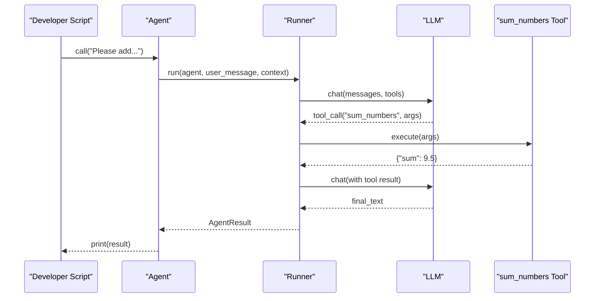
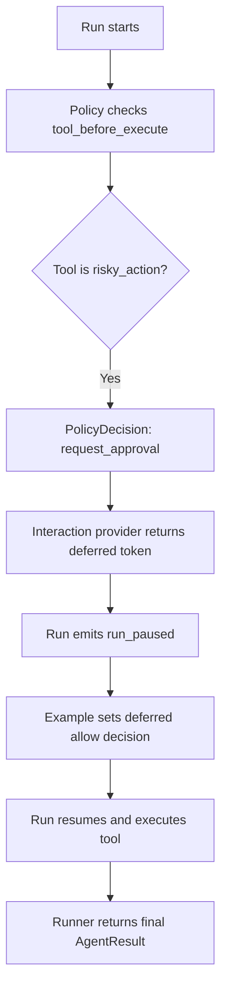
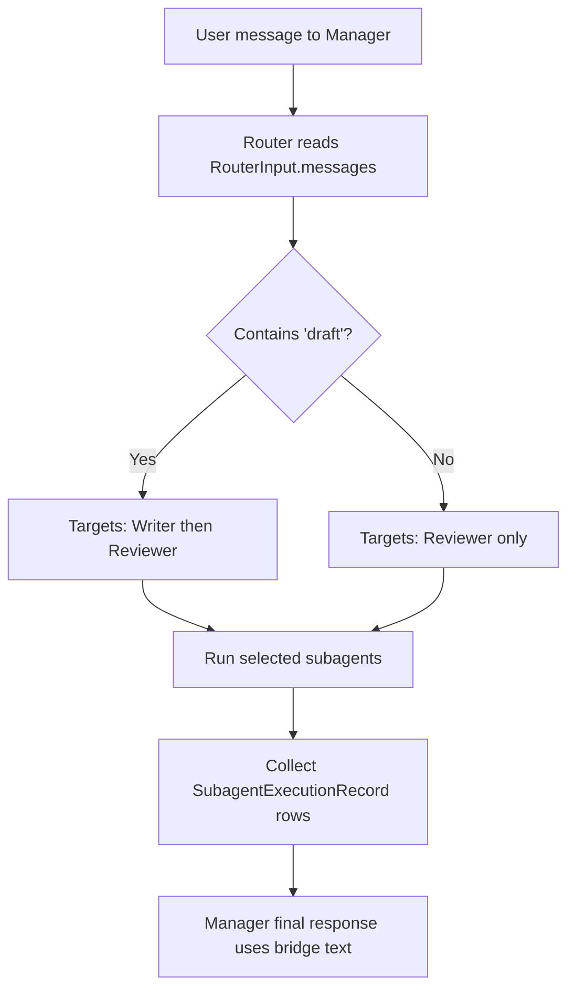
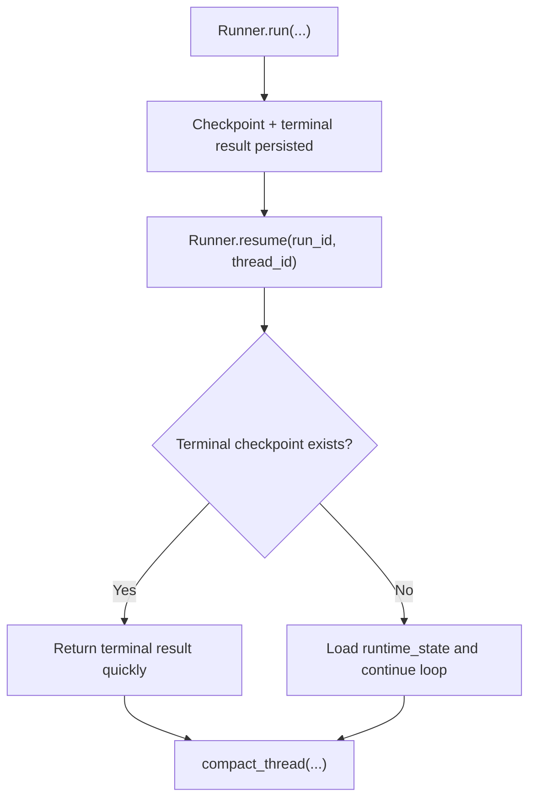
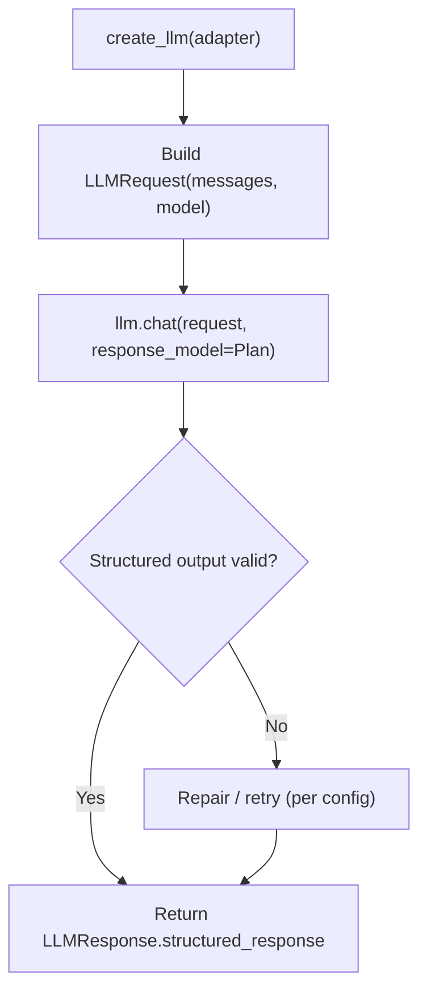
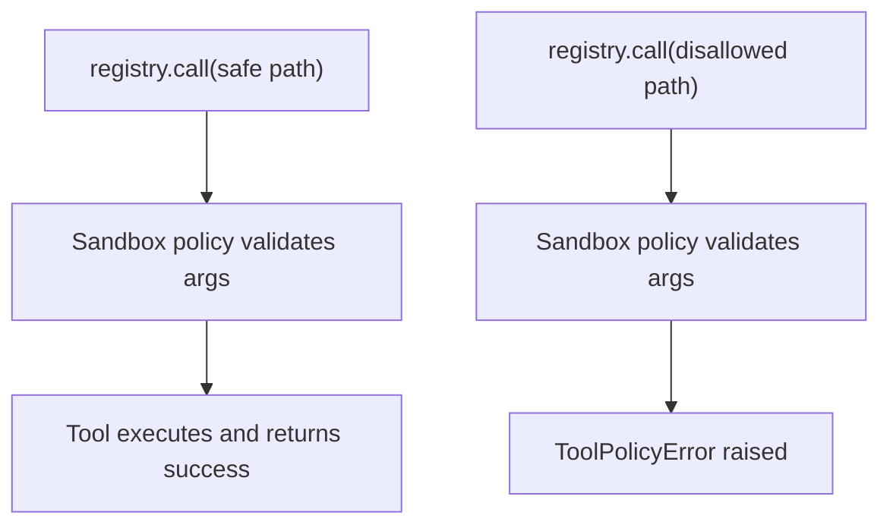
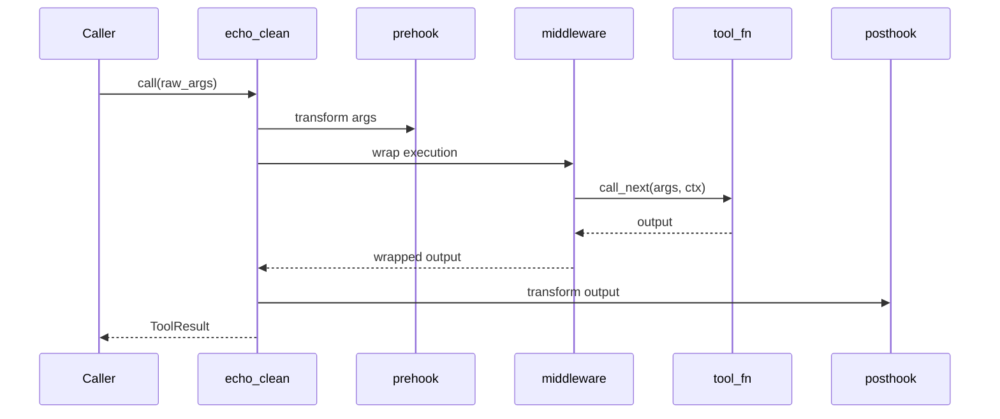
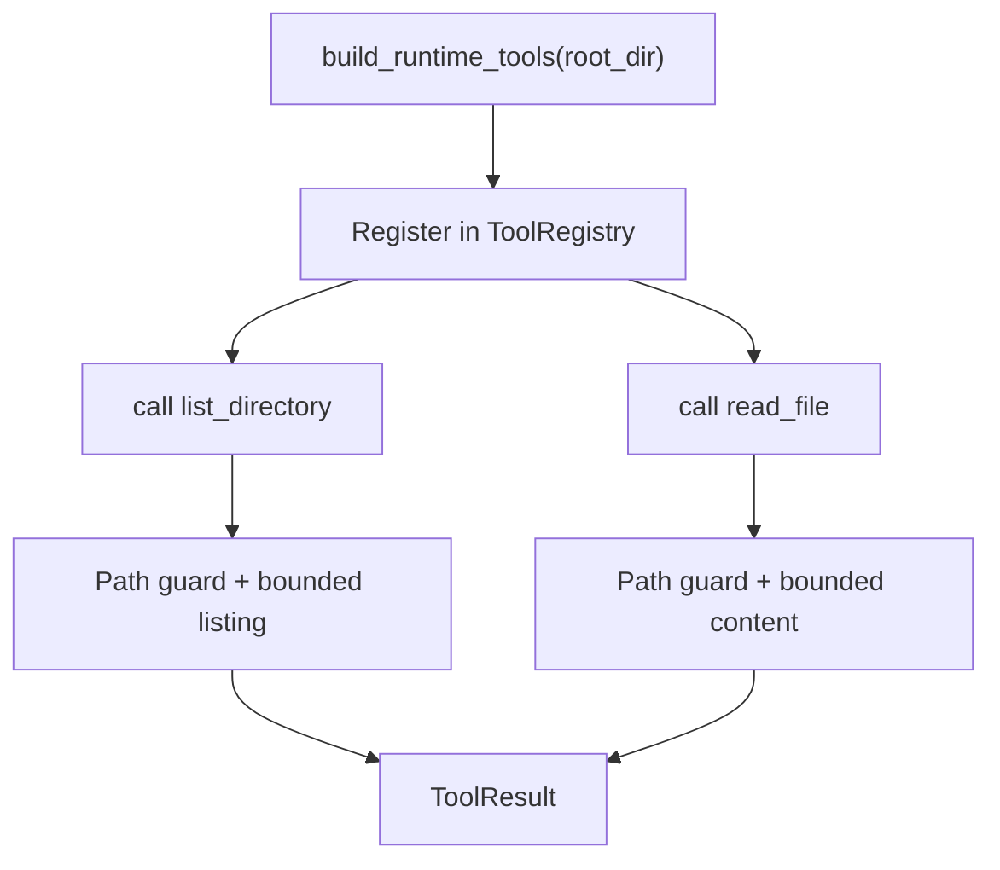

# AFK Examples Runbook

Each example is a runnable `.py` file designed for copy-paste learning.

## Before You Run

1. Install deps:
   - `uv sync`
2. Set environment:
   - `export AFK_LLM_ADAPTER=openai`
   - `export AFK_LLM_MODEL=gpt-4.1-mini`
   - `export AFK_LLM_API_KEY=...`

## Example Order

1. `01_minimal_chat_agent.py`
   - Basic `Agent` + typed tool + one-shot run.
2. `02_policy_with_hitl.py`
   - Policy engine + deferred approval flow.
3. `03_subagents_with_router.py`
   - Parent agent routing into named subagents.
4. `04_resume_and_compact.py`
   - `Runner.run`, `Runner.resume`, and memory compaction.
5. `05_direct_llm_structured_output.py`
   - Direct `afk.llms` usage with `response_model` validation.
6. `06_tool_registry_security.py`
   - Tool registry sandbox policy and output limiting.
7. `07_tool_hooks_and_middleware.py`
   - Tool prehook/posthook and middleware chain.
8. `08_prebuilt_runtime_tools.py`
   - Runtime-safe filesystem tools from `build_runtime_tools(...)`.

## Run Commands

```bash
uv run python docs/library/examples/01_minimal_chat_agent.py
uv run python docs/library/examples/02_policy_with_hitl.py
uv run python docs/library/examples/03_subagents_with_router.py
uv run python docs/library/examples/04_resume_and_compact.py
uv run python docs/library/examples/05_direct_llm_structured_output.py
uv run python docs/library/examples/06_tool_registry_security.py
uv run python docs/library/examples/07_tool_hooks_and_middleware.py
uv run python docs/library/examples/08_prebuilt_runtime_tools.py
```

## Notes

- These examples prioritize clarity over production completeness.
- For production setup, pair with:
  - `docs/library/security-model.md`
  - `docs/library/failure-policy-matrix.md`
  - `docs/library/checkpoint-schema.md`

## Code Walkthroughs With Diagrams

### 01. Minimal Chat Agent

Code:
- [01_minimal_chat_agent.py](./01_minimal_chat_agent.py)

What the code does:
- Defines a typed tool (`sum_numbers`) with Pydantic validation.
- Creates one `Agent` with model + instructions + tool list.
- Calls `agent.call(...)` once and prints the final `AgentResult`.



What to customize first:
- `instructions`
- tool function behavior
- `context` keys

### 02. Policy With HITL

Code:
- [02_policy_with_hitl.py](./02_policy_with_hitl.py)

What the code does:
- Adds a policy rule that gates `risky_action` with `request_approval`.
- Uses `InMemoryInteractiveProvider` for deferred decisions.
- Watches run events and resolves approval token during `run_paused`.



What to customize first:
- policy rules (`tool_name`, `event_type`, `action`)
- approval timeout/fallback in `RunnerConfig`

### 03. Subagents With Router

Code:
- [03_subagents_with_router.py](./03_subagents_with_router.py)

What the code does:
- Defines `Writer` and `Reviewer` subagents.
- Defines `route_subagents(...)` that inspects transcript text.
- `Manager` agent delegates to selected subagents and merges outputs.



Key idea for juniors:
- Router does not execute tools itself.
- Router only selects subagent names.
- Runner executes those subagents and injects their output back to parent flow.

What to customize first:
- router decision logic
- `inherit_context_keys` per subagent
- subagent instructions

### 04. Resume And Compact

Code:
- [04_resume_and_compact.py](./04_resume_and_compact.py)

What the code does:
- Executes one run with `Runner.run(...)`.
- Calls `Runner.resume(...)` using the same `run_id` and `thread_id`.
- Calls `Runner.compact_thread(...)` to apply retention policies.



What to customize first:
- memory backend
- event/state retention limits

### 05. Direct LLM Structured Output

Code:
- [05_direct_llm_structured_output.py](./05_direct_llm_structured_output.py)

What the code does:
- Uses `afk.llms.create_llm(...)` directly.
- Builds `LLMRequest` manually.
- Requests typed output with `response_model=Plan`.



What to customize first:
- adapter selection
- model name
- response schema

### 06. Tool Registry Security

Code:
- [06_tool_registry_security.py](./06_tool_registry_security.py)

What the code does:
- Creates a sandbox profile with path allowlist and command/network restrictions.
- Builds a `ToolRegistry` with sandbox policy + output limit middleware.
- Shows one allowed path call and one blocked path call.



What to customize first:
- `allowed_paths`
- `allow_command_execution`
- `max_output_chars`

### 07. Tool Hooks and Middleware

Code:
- [07_tool_hooks_and_middleware.py](./07_tool_hooks_and_middleware.py)

What the code does:
- Uses a prehook to normalize arguments.
- Uses middleware to wrap the tool function behavior.
- Uses a posthook to shape final output payload.



What to customize first:
- prehook normalization rules
- middleware logging/metrics behavior
- posthook output schema

### 08. Prebuilt Runtime Tools

Code:
- [08_prebuilt_runtime_tools.py](./08_prebuilt_runtime_tools.py)

What the code does:
- Builds prebuilt tools (`list_directory`, `read_file`) for a fixed root.
- Registers them in `ToolRegistry`.
- Calls both tools with safe bounded args.



What to customize first:
- runtime root directory
- `max_entries` and `max_chars` limits
