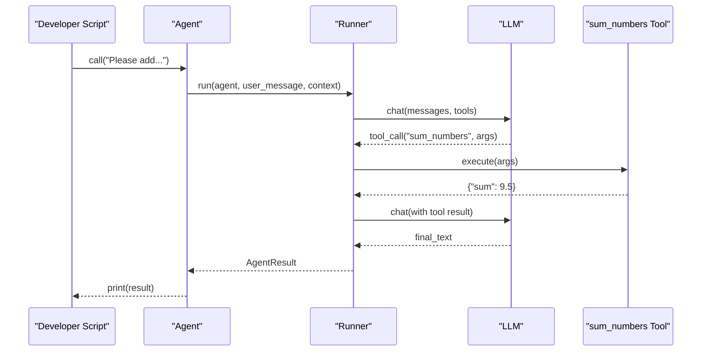
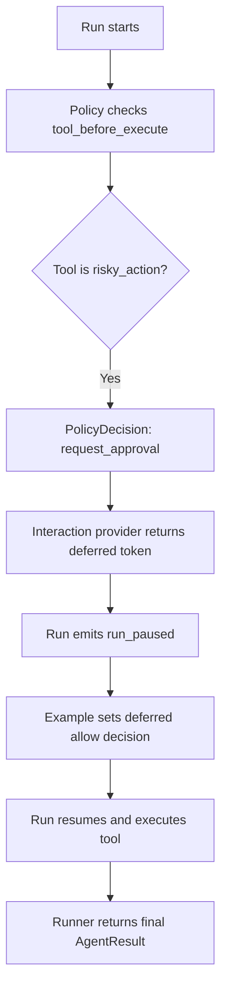
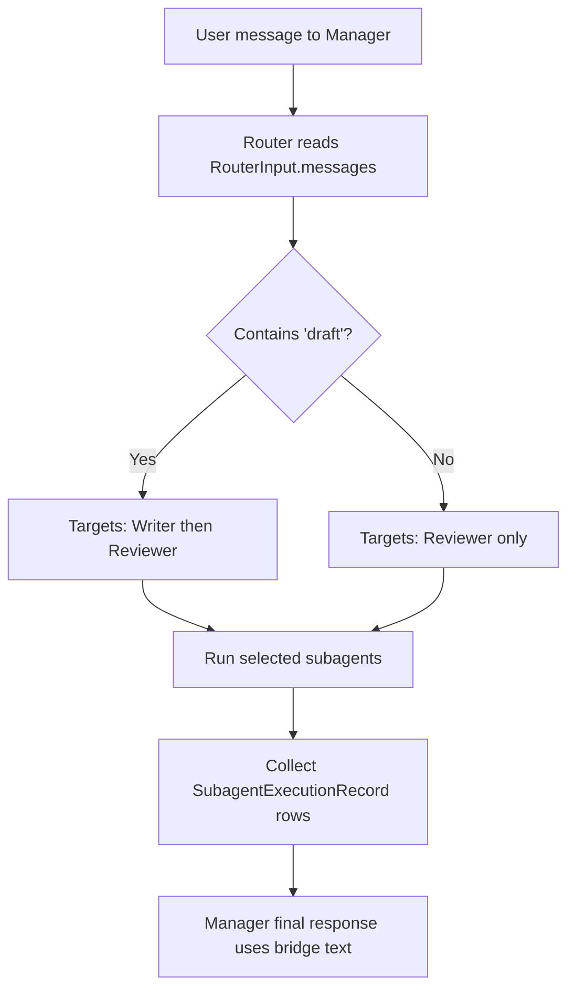
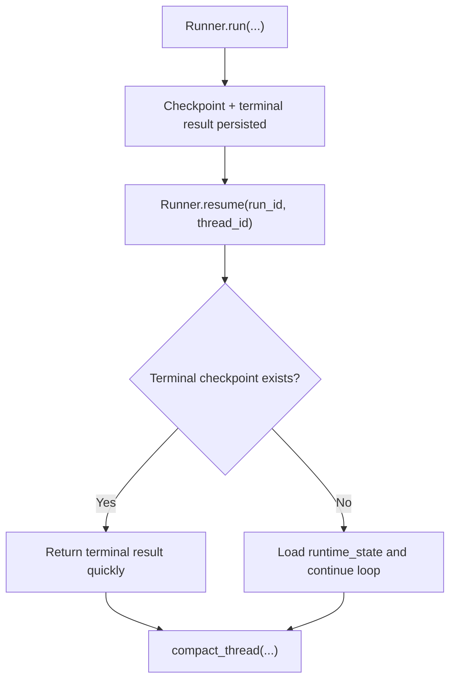
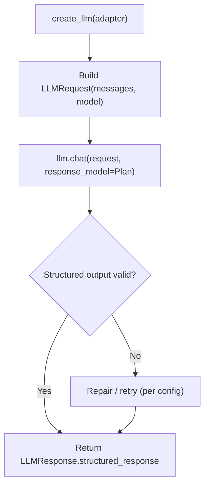
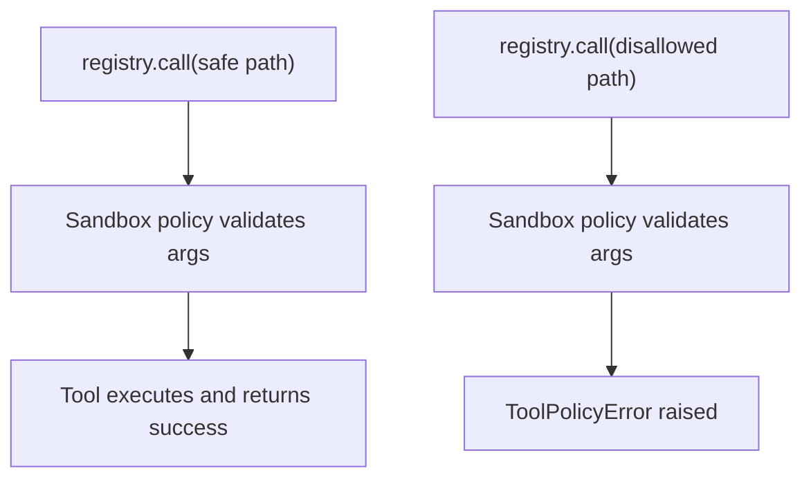
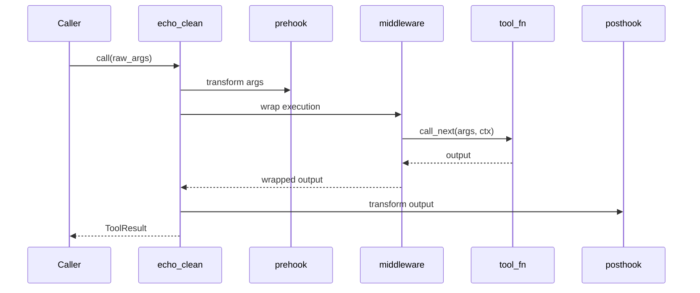
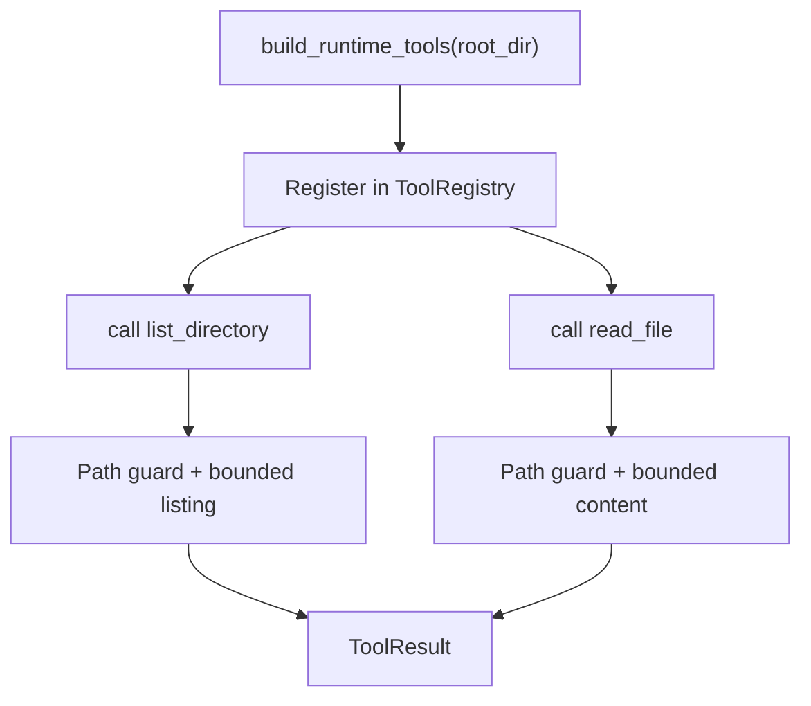

import Example01Source from "/library/snippets/01_minimal_chat_agent.mdx";
import Example02Source from "/library/snippets/02_policy_with_hitl.mdx";
import Example03Source from "/library/snippets/03_subagents_with_router.mdx";
import Example04Source from "/library/snippets/04_resume_and_compact.mdx";
import Example05Source from "/library/snippets/05_direct_llm_structured_output.mdx";
import Example06Source from "/library/snippets/06_tool_registry_security.mdx";
import Example07Source from "/library/snippets/07_tool_hooks_and_middleware.mdx";
import Example08Source from "/library/snippets/08_prebuilt_runtime_tools.mdx";

Every example is embedded below as a copy-ready script using the published `afk` SDK (`from afk...` imports).

<Tip>
Run examples in order. Each one introduces one new concept while preserving the previous mental model.
</Tip>

## Fast Learning Path

<Steps>
  <Step title="01: minimal baseline">Run `01_minimal_chat_agent.py` and validate model + tool loop.</Step>
  <Step title="02: safety gates">Add policy and deferred approvals with `02_policy_with_hitl.py`.</Step>
  <Step title="03: orchestration">Add subagent routing with `03_subagents_with_router.py`.</Step>
  <Step title="04: durability">Add checkpoint/resume with `04_resume_and_compact.py`.</Step>
</Steps>

## Before You Run

<CodeGroup>

```bash uv
uv pip install afk pydantic
export AFK_LLM_ADAPTER=openai
export AFK_LLM_MODEL=gpt-4.1-mini
export AFK_LLM_API_KEY=your_key_here
```

```bash pip
pip install afk pydantic
export AFK_LLM_ADAPTER=openai
export AFK_LLM_MODEL=gpt-4.1-mini
export AFK_LLM_API_KEY=your_key_here
```

</CodeGroup>

## Example Catalog

<CardGroup cols={2}>
  <Card title="01 Minimal Agent" href="#01-minimal-chat-agent" icon="play-circle">
    Agent + typed tool + one-shot run.
  </Card>
  <Card title="02 Policy + HITL" href="#02-policy-with-hitl" icon="shield">
    Deferred approvals and pause/resume flow.
  </Card>
  <Card title="03 Subagents Router" href="#03-subagents-with-router" icon="workflow">
    Manager routes requests to worker subagents.
  </Card>
  <Card title="04 Resume + Compact" href="#04-resume-and-compact" icon="database">
    Checkpoint persistence, resume, and retention.
  </Card>
  <Card title="05 Direct LLM" href="#05-direct-llm-structured-output" icon="cpu">
    Use `afk.llms` with typed structured response.
  </Card>
  <Card title="06 Tool Security" href="#06-tool-registry-security" icon="lock">
    Sandbox policy and output limits.
  </Card>
  <Card title="07 Hooks + Middleware" href="#07-tool-hooks-and-middleware" icon="layers">
    Tool interception and output shaping.
  </Card>
  <Card title="08 Runtime Tools" href="#08-prebuilt-runtime-tools" icon="folder">
    Safe filesystem tools for agent runtime.
  </Card>
</CardGroup>

## Run Commands

Use the same filenames shown in each accordion code block.

<Tabs>
  <Tab title="One by one">

```bash
python 01_minimal_chat_agent.py
python 02_policy_with_hitl.py
python 03_subagents_with_router.py
python 04_resume_and_compact.py
python 05_direct_llm_structured_output.py
python 06_tool_registry_security.py
python 07_tool_hooks_and_middleware.py
python 08_prebuilt_runtime_tools.py
```

  </Tab>
  <Tab title="Batch run">

```bash
for f in 0*.py; do python "$f"; done
```

  </Tab>
</Tabs>

## 01. Minimal Chat Agent

<Accordion title="Source code: 01_minimal_chat_agent.py">
  <Example01Source />
</Accordion>

- Defines a typed tool (`sum_numbers`) with Pydantic validation.
- Creates one `Agent` with model, instructions, and tool list.
- Calls `agent.call(...)` and returns `AgentResult`.



## 02. Policy With HITL

<Accordion title="Source code: 02_policy_with_hitl.py">
  <Example02Source />
</Accordion>

- Adds policy rule that gates `risky_action` with `request_approval`.
- Uses `InMemoryInteractiveProvider` for deferred decisions.
- Resolves deferred approval after `run_paused` event.



## 03. Subagents With Router

<Accordion title="Source code: 03_subagents_with_router.py">
  <Example03Source />
</Accordion>

- Defines `Writer` and `Reviewer` subagents.
- Router inspects transcript text and returns subagent names.
- Manager runs selected subagents and merges outputs.



## 04. Resume And Compact

<Accordion title="Source code: 04_resume_and_compact.py">
  <Example04Source />
</Accordion>

- Runs once with `Runner.run(...)`.
- Resumes with same `run_id` and `thread_id`.
- Compacts thread records with retention policies.



## 05. Direct LLM Structured Output

<Accordion title="Source code: 05_direct_llm_structured_output.py">
  <Example05Source />
</Accordion>

- Uses `afk.llms.create_llm(...)` directly.
- Builds `LLMRequest` manually.
- Validates typed response with `response_model=Plan`.



## 06. Tool Registry Security

<Accordion title="Source code: 06_tool_registry_security.py">
  <Example06Source />
</Accordion>

- Builds a sandbox profile with allowlists and execution restrictions.
- Registers tools in `ToolRegistry` with output-limiting middleware.
- Demonstrates one allowed path and one blocked path call.



## 07. Tool Hooks And Middleware

<Accordion title="Source code: 07_tool_hooks_and_middleware.py">
  <Example07Source />
</Accordion>

- Uses prehook to normalize arguments.
- Uses middleware to wrap tool behavior.
- Uses posthook to shape final output.



## 08. Prebuilt Runtime Tools

<Accordion title="Source code: 08_prebuilt_runtime_tools.py">
  <Example08Source />
</Accordion>

- Builds prebuilt filesystem tools with `build_runtime_tools(root_dir)`.
- Registers them in a `ToolRegistry`.
- Calls both tools using bounded/safe arguments.



## Related Docs

- [Tool Call Lifecycle](/library/tool-call-lifecycle)
- [Security Model](/library/security-model)
- [Checkpoint & Resume](/library/checkpoint-schema)
