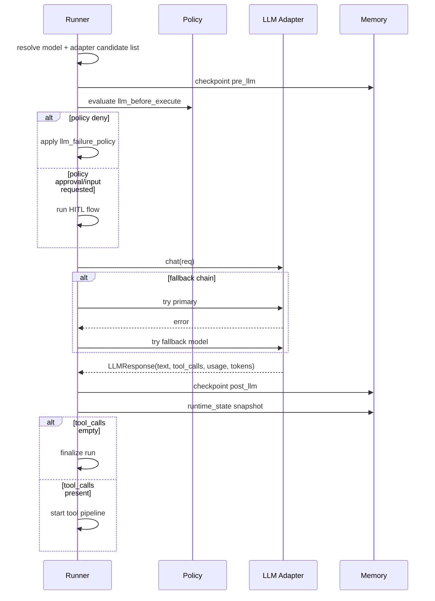

# LLM Interaction Flow

This document describes how AFK constructs, validates, executes, retries, and records LLM calls.

## TL;DR

- Runner creates step-scoped `LLMRequest` objects with idempotency keys.
- Policy gates can deny/defer/require approval before each LLM call.
- Fallback model chain is attempted when configured.
- Structured output validation and repair happen in the LLM layer.

## When To Read This

- You need predictable retries/fallback behavior.
- You are debugging structured output failures.
- You are implementing custom LLM adapters or model resolver logic.

Primary code paths:

- [afk/core/runner_execution.py](../../src/afk/core/runner_execution.py)
- [afk/core/runner_internals.py](../../src/afk/core/runner_internals.py)
- [afk/llms/llm.py](../../src/afk/llms/llm.py)
- [afk/llms/factory.py](../../src/afk/llms/factory.py)
- [afk/agents/resolution.py](../../src/afk/agents/resolution.py)

## Runner-Side LLM Call Flow

## Request Construction in Runner

For each step, runner builds `LLMRequest` with:

- `model`: current candidate model
- `request_id`: `{run_id}:step:{step}`
- `idempotency_key`: `{run_id}:step:{step}`
- `messages`: full transcript at step boundary
- `tools`: exported registry tool definitions (or `None`)
- `tool_choice`: `"auto"` when tools exist
- `session_token` / `checkpoint_token`
- metadata including run/thread context and trust-channel markers

## Model Resolution and Fallback

Initial resolution:
- done by `resolve_model_to_llm(...)`
- supports explicit adapter prefixes and inferred defaults

Fallback chain:
- built by `_build_llm_candidates(...)`
- primary + unique models from `FailSafeConfig.fallback_model_chain`
- deduplicated by `(adapter, normalized_model)`

Circuit breaker key for LLM dependency:
- `llm:{adapter}:{normalized_model}`

## Retry and Idempotency

In `LLM` base class:

- `_call_with_retries(...)` handles retry loops.
- Retryability is based on error classification.
- Chat/stream retry eligibility depends on idempotency safety rules.

In runner path:
- request is created with step-scoped idempotency key.
- fallback model attempts are handled at runner level.

## Structured Output Behavior

When `response_model` is used at LLM layer:

1. validate provider structured payload when present
2. else parse JSON from text
3. on failure, issue repair prompt and retry up to `json_max_retries`
4. raise invalid response error if still invalid

## Streaming and Interrupt

`LLM.chat_stream_handle(...)`:

- provides single-consumer event stream
- enforces exactly one completion event
- supports `cancel()`
- supports `interrupt()` when adapter capability is enabled

Runner integration:

- if adapter supports interrupt + streaming, runner uses stream handle path
- runner wires interrupt callback into run handle during call

## LLM Events and Checkpoints

Events around LLM stage:

- `llm_called`
- `llm_completed`
- optional `warning` and terminal events on failure paths

Checkpoint phases:

- `pre_llm`
- `post_llm`
- `runtime_state`

## Important Edge Cases

- LLM policy deny can degrade or fail run depending on `llm_failure_policy`.
- If cost exceeds `max_total_cost_usd`, runner raises budget exceeded error.
- If streaming call is interrupted/cancelled, runner converts to interrupted/cancelled run outcomes.
- If all fallback candidates fail, final error is surfaced unless policy degrades run.

## Implementation Checklist

1. Set explicit adapter + model (`openai/...`, `anthropic/...`, or resolver).
2. Configure `LLMConfig` retry/timeout settings for your latency budget.
3. Set `fallback_model_chain` in `FailSafeConfig` for provider outages.
4. Use `response_model` for typed outputs and handle validation failures.
5. Track `llm_called` / `llm_completed` events for observability.

## Related Example

- [examples/05_direct_llm_structured_output.py](./examples/05_direct_llm_structured_output.py)
