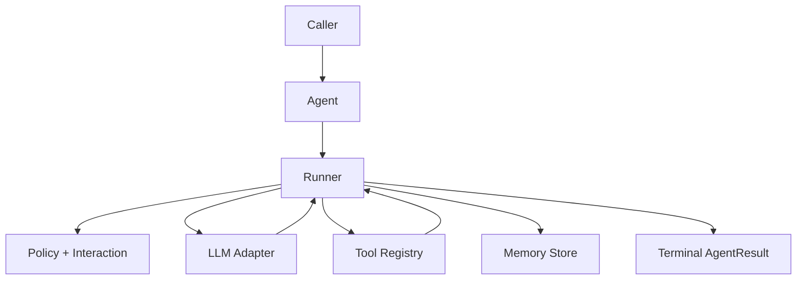

<Info>
All examples are embedded as copy-ready scripts and use public SDK imports (`afk.*`) only.
</Info>

## Start Here (DX Path)

<CardGroup cols={2}>
  <Card title="1) Developer Guide" icon="rocket" href="/library/developer-guide">
    Fast onboarding path for first production-ready agent behavior.
  </Card>
  <Card title="2) Examples" icon="code" href="/library/examples/index">
    Eight runnable examples with diagrams and extension tips.
  </Card>
  <Card title="3) Architecture" icon="git-branch" href="/library/architecture">
    Execution flow, state model, persistence, and safety boundaries.
  </Card>
  <Card title="4) API Reference" icon="book" href="/library/api-reference">
    Public APIs, contracts, edge cases, and import patterns.
  </Card>
</CardGroup>

## Quickstart (Copy/Paste)

<CodeGroup>

```bash uv
uv pip install afk pydantic
export AFK_LLM_ADAPTER=openai
export AFK_LLM_MODEL=gpt-4.1-mini
export AFK_LLM_API_KEY=your_key_here
python -c "import afk; print('AFK SDK ready')"
```

```bash pip
pip install afk pydantic
export AFK_LLM_ADAPTER=openai
export AFK_LLM_MODEL=gpt-4.1-mini
export AFK_LLM_API_KEY=your_key_here
python -c "import afk; print('AFK SDK ready')"
```

</CodeGroup>

## Public Imports Only

```python
from afk.agents import Agent
from afk.core import Runner, RunnerConfig
from afk.llms import create_llm
from afk.tools import tool
from afk import agents, core, llms, tools, memory, evals
```

<Warning>
Avoid importing from `src/...` in application code. Stay on public imports (`afk.*`) for stability across releases.
</Warning>

## Runtime Mental Model



## Read By Goal

<CardGroup cols={2}>
  <Card title="Need HITL + approvals" href="/library/tool-call-lifecycle" icon="shield-check">
    Tool policy gates, deferred approvals, and fallback behavior.
  </Card>
  <Card title="Need subagents + routing" href="/library/agentic-behavior" icon="workflow">
    Router semantics, orchestration flow, and subagent execution records.
  </Card>
  <Card title="Need resume + compaction" href="/library/checkpoint-schema" icon="database">
    Checkpoint shape, replay behavior, and resume guarantees.
  </Card>
  <Card title="Need direct LLM control" href="/library/llm-interaction" icon="cpu">
    Request/response lifecycle, structured output, and retries.
  </Card>
</CardGroup>

## Learn by Need

<Tabs>
  <Tab title="Build Features">
    <ul>
      <li>Approvals/HITL: <a href="/library/tool-call-lifecycle">Tool Call Lifecycle</a></li>
      <li>Agent skills: <a href="/library/agent-skills">Agent Skills</a></li>
      <li>Subagent orchestration: <a href="/library/agentic-behavior">Agentic Behavior</a></li>
      <li>Resume/checkpoints: <a href="/library/checkpoint-schema">Checkpoint Schema</a></li>
      <li>Tool hardening: <a href="/library/security-model">Security Model</a></li>
    </ul>

  </Tab>
  <Tab title="Deep Internals">
    <ul>
      <li>LLM runtime internals: <a href="/library/llm-interaction">LLM Interaction</a></li>
      <li>Full public contract: <a href="/library/api-reference">API Reference</a></li>
      <li>Full source symbol map: <a href="/library/full-module-reference">Full Module Reference</a></li>
    </ul>

  </Tab>
</Tabs>

## Production Checklist

<Steps>
  <Step title="Start from runnable baseline">Use the `01_minimal_chat_agent.py` snippet from `/library/examples/index` and keep the first run deterministic.</Step>
  <Step title="Harden tool safety">Add typed args, policy rules, sandbox restrictions, and output limits.</Step>
  <Step title="Enable durability">Persist checkpoints in non-ephemeral storage and validate resume behavior.</Step>
  <Step title="Prevent regressions">Add eval scenarios for business-critical tool and policy paths.</Step>
</Steps>
