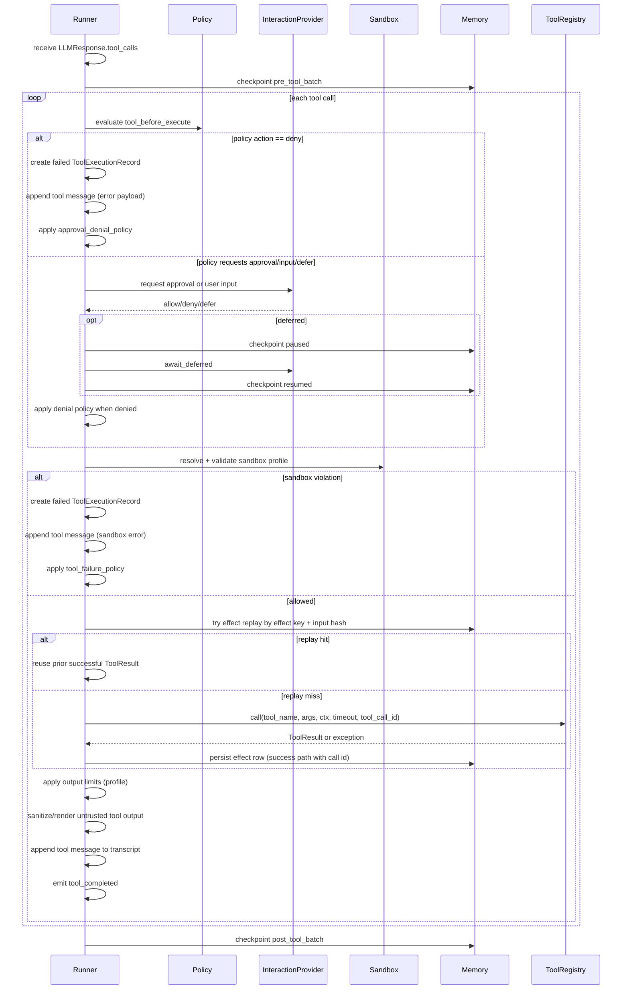

This document describes the exact lifecycle AFK uses when an LLM returns tool calls.

## TL;DR

- Every tool call is policy-gated before execution.
- Optional approval/user-input gates can pause/resume runs.
- Sandbox validation runs before tool invocation.
- Successful effects are persisted for idempotent replay.

## When To Read This

- You are building tools with side effects.
- You need to debug why a tool did not execute.
- You are implementing policy/sandbox controls for production.

Primary code paths:

- [afk/core/runner_execution.py](https://github.com/socioy/afk/blob/main/src/afk/core/runner_execution.py)
- [afk/core/runner_interaction.py](https://github.com/socioy/afk/blob/main/src/afk/core/runner_interaction.py)
- [afk/core/runner_internals.py](https://github.com/socioy/afk/blob/main/src/afk/core/runner_internals.py)
- [afk/tools/registery.py](https://github.com/socioy/afk/blob/main/src/afk/tools/registery.py)
- [afk/tools/security.py](https://github.com/socioy/afk/blob/main/src/afk/tools/security.py)

## End-to-End Flow

## Detailed Stages

1. Tool batch starts
- Event emitted: `tool_batch_started`
- Checkpoint phase: `pre_tool_batch`

2. Per-tool policy evaluation
- Policy event: `tool_before_execute`
- Possible actions:
  - `allow`
  - `deny`
  - `defer`
  - `request_approval`
  - `request_user_input`
- `updated_tool_args` may rewrite raw tool args before execution.

3. Approval or user-input gate
- Immediate decisions are handled directly.
- Deferred decisions pause run and resume on token resolution.
- Timeout fallback uses `RunnerConfig.approval_fallback` or `RunnerConfig.input_fallback`.

4. Sandbox/security gate
- Effective profile resolved from:
  - per-call `sandbox_profile_provider`
  - fallback `default_sandbox_profile`
- Validation checks:
  - network access
  - command execution and allowlisted command prefixes
  - shell operators
  - path allowlist/denylist

5. Effect replay and idempotency
- Replay key: `effect:{run_id}:{step}:{tool_call_id}`
- Replay allowed only when:
  - `tool_call_id` exists
  - stored `input_hash` matches current hash
  - stored row marked `success=True`
- Input hash mismatch raises checkpoint corruption error.

6. Tool execution
- Executed through `ToolRegistry.call(...)`
- Context includes run/thread ids and optional secret scope metadata.
- Per-call timeout may come from sandbox profile command timeout.

7. Output handling
- Output is truncated by profile/output-limit middleware if configured.
- Output is rendered as untrusted payload unless sanitization is disabled.
- Tool message is appended to transcript for next LLM turn.

8. Failure policy handling
- Tool failures are mapped through `tool_failure_policy`:
  - fail run
  - degrade run
  - continue

9. Batch completion
- Checkpoint phase: `post_tool_batch`
- Runtime snapshot persisted afterward.

## Events and Checkpoints in Tool Stage

Events emitted in this stage:

- `tool_batch_started`
- `tool_completed`
- optional `warning` and terminal events based on policy/failure

Checkpoint phases touched in this stage:

- `pre_tool_batch`
- `post_tool_batch`
- `runtime_state`

## Operational Notes

- `tool_calls` budget is enforced at runner level.
- Circuit breaker key for tools is `tool:{tool_name}`.
- Runtime and skill tools are registered in the same registry as user tools.
- Tool replay does not re-run side effects when effect row is valid.

## Implementation Checklist

1. Keep tool args strongly typed (`pydantic` models).
2. Add policy rules for sensitive tools (`request_approval` or `deny`).
3. Enforce sandbox profile and command/path allowlists.
4. Use deterministic `tool_call_id` flows for replay safety.
5. Emit and monitor `tool_completed` outcomes in telemetry/event sinks.

## Related Examples

- [examples/02_policy_with_hitl.py](/library/examples/index#02-policy-with-hitl)
- [examples/06_tool_registry_security.py](/library/examples/index#06-tool-registry-security)
