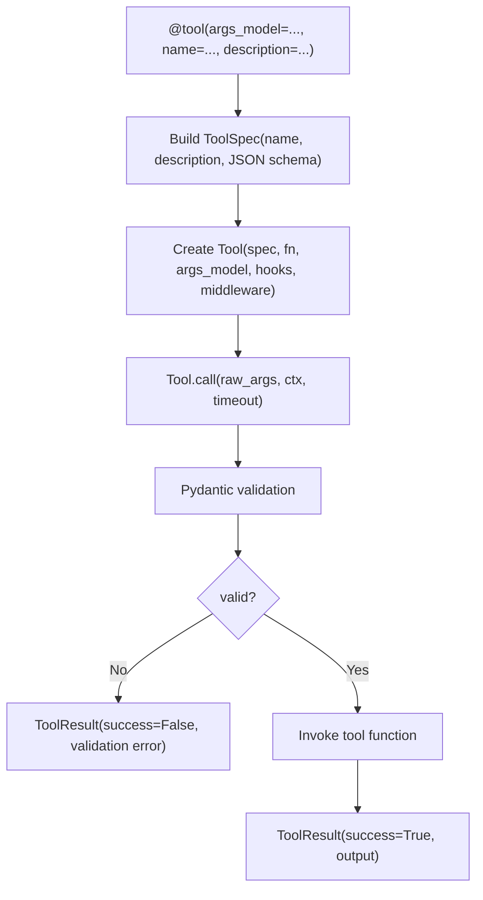
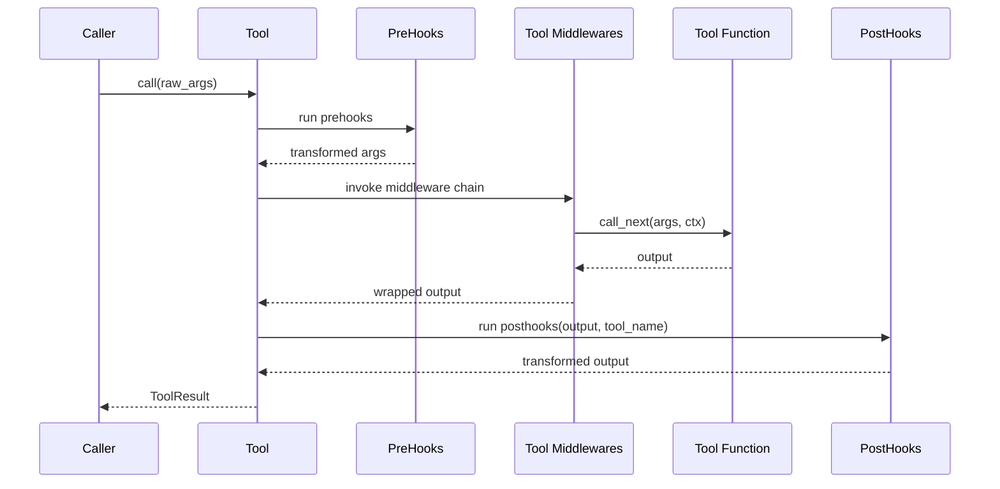
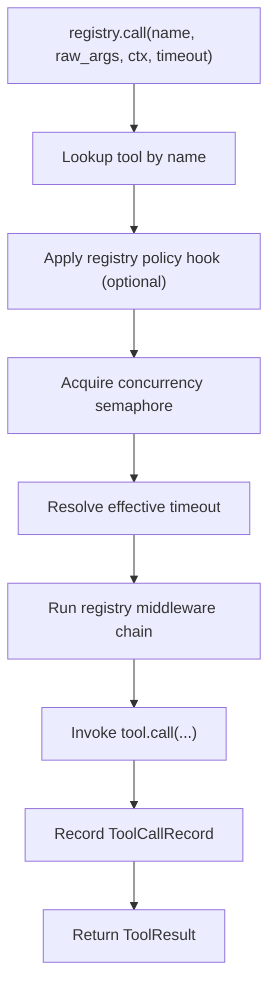
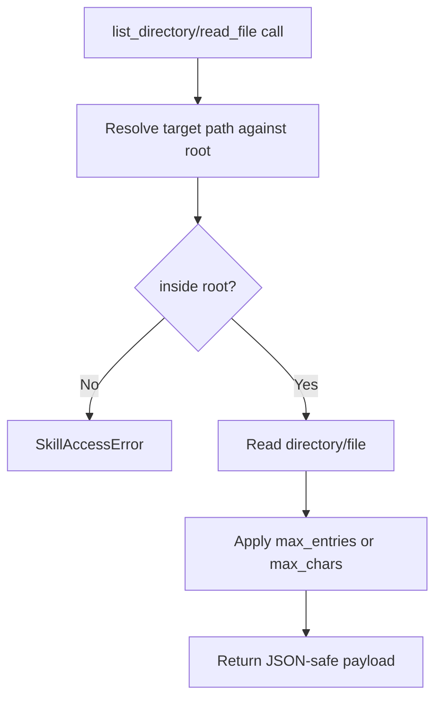
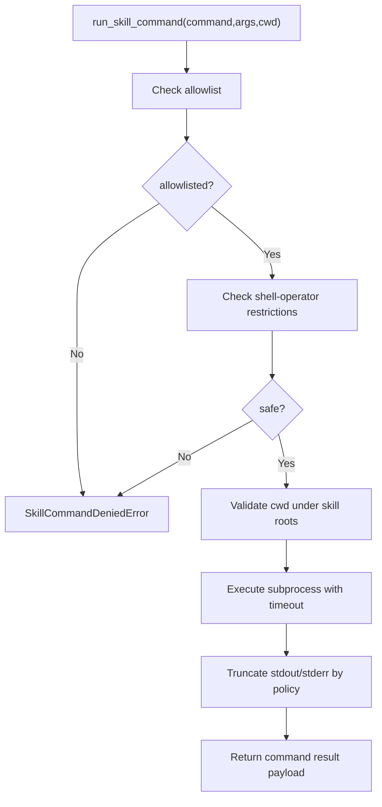
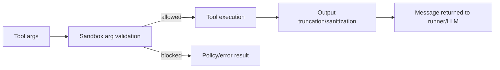

This guide explains the rest of the tooling stack with code-level flow diagrams.

Primary code paths:

- [afk/tools/core/decorator.py](https://github.com/socioy/afk/blob/main/src/afk/tools/core/decorator.py)
- [afk/tools/core/base.py](https://github.com/socioy/afk/blob/main/src/afk/tools/core/base.py)
- [afk/tools/registery.py](https://github.com/socioy/afk/blob/main/src/afk/tools/registery.py)
- [afk/tools/prebuilts/runtime.py](https://github.com/socioy/afk/blob/main/src/afk/tools/prebuilts/runtime.py)
- [afk/tools/prebuilts/skills.py](https://github.com/socioy/afk/blob/main/src/afk/tools/prebuilts/skills.py)
- [afk/tools/security.py](https://github.com/socioy/afk/blob/main/src/afk/tools/security.py)

## TL;DR

- `@tool` wraps a function into a typed, validated `Tool`.
- `description` is exported to the model and improves tool selection quality.
- Hooks and middleware control behavior before/after tool logic.
- `ToolRegistry` adds concurrency control, policies, and middleware for all tools.
- Prebuilt runtime/skill tools are generated per run with path and command guards.

## 1) Decorator to Tool Object Flow



### Why `description` matters

- `ToolRegistry.to_openai_function_tools()` sends `name`, `description`, and `parameters` to the LLM.
- Better descriptions reduce wrong-tool calls and improve argument quality.
- If you omit `description`, AFK uses the function docstring first line as fallback.

```python
@tool(
    args_model=SearchArgs,
    name="search_docs",
    description="Search internal docs by query and return top relevant snippets.",
)
async def search_docs(args: SearchArgs) -> dict:
    ...
```

## 2) Hook + Middleware Chain

`Tool` execution order:

1. prehooks
2. middleware chain
3. main tool function
4. posthooks



## 3) Registry Execution Flow

`ToolRegistry.call(...)` flow:



Key behavior:

- timeout precedence: call arg -> tool default -> registry default
- unknown tool: `ToolNotFoundError`
- policy rejection: `ToolPolicyError`

## 4) Prebuilt Runtime Filesystem Tools

`build_runtime_tools(root_dir=...)` returns:

- `list_directory`
- `read_file`

Safety model:

- target path is resolved and must stay under `root_dir`
- escaping root raises `SkillAccessError`



## 5) Prebuilt Skill Tools

`build_skill_tools(skills, policy)` returns:

- `list_skills`
- `read_skill_md`
- `read_skill_file`
- `run_skill_command`

Deep dive: [Agent Skills](/library/agent-skills)



## 6) Security Layers For Tools

Tool security can be applied at two levels:

- pre-execution arg validation (`validate_tool_args_against_sandbox`)
- post-execution output limiting (`apply_tool_output_limits`)



## Runnable Examples

- [examples/06_tool_registry_security.py](/library/examples/index#06-tool-registry-security)
- [examples/07_tool_hooks_and_middleware.py](/library/examples/index#07-tool-hooks-and-middleware)
- [examples/08_prebuilt_runtime_tools.py](/library/examples/index#08-prebuilt-runtime-tools)
